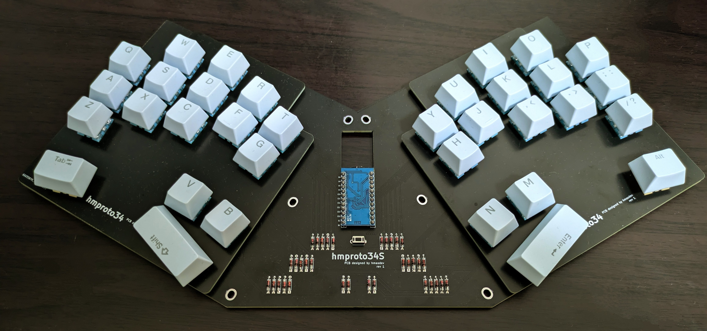
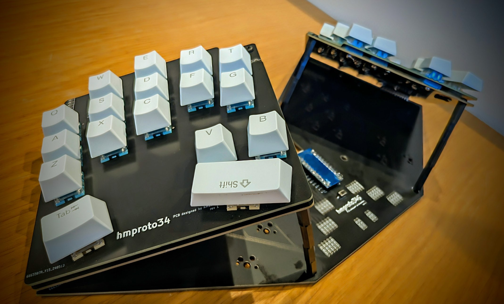

# hmproto34s


hmproto34s is a hand-fitted keyboard with 34 keys.

hmproto34s is a derivative of [hmproto34](https://github.com/hmasdev/hmproto34).

hmproto34s has 3D-style and normal-style.






## How to Use

The most simple way to use hmproto34s is to flash the pre-built firmware to your keyboard.

Download the latest firmware from [Releases](https://github.com/hmasdev/hmproto34s/releases), which enables you to customize the keymap using [Vial](https://vial.rocks/).

Then follow the instructions in [How to Flash Firmware](#how-to-flash-firmware).

The next 2 subsections explain how to build firmware and flash it to your keyboard.

If you want to know how to build the keyboard, see [How to Build Keyboard](#how-to-build-keyboard).

### How to Build Firmware

1. Setup your QMK environment
   - if you use Windows, install [QMK MSYS](https://msys.qmk.fm/)
   - See [https://docs.qmk.fm/#/newbs_getting_started?id=set-up-your-environment](https://docs.qmk.fm/#/newbs_getting_started?id=set-up-your-environment) for more information.
   - NOTE: assume that `qmk_firmware` directory is located at `~/qmk_firmware` in the following steps.

2. Open QMK MSYS
   - If you use Windows, open QMK from the start menu. See [https://msys.qmk.fm/guide.html#next-steps](https://msys.qmk.fm/guide.html#next-steps).

3. Clone this repository

   ```sh
   cd ~/qmk_firmware/keyboards
   git clone git@github.com:hmasdev/hmproto34s.git
   ```

4. Build firmware

   ```sh
   qmk compile -kb hmproto34s -km default
   ```

Good! Now, you have a built firmware in `~/qmk_firmware/.build/hmproto34s_default.hex`.

### How to Flash Firmware

1. Visit [Pro Micro Web Updater](https://sekigon-gonnoc.github.io/promicro-web-updater/index.html);
2. Select the firmware file (`~/qmk_firmware/.build/hmproto34s_default.hex`);
3. Connect your left keyboard to your computer and press its reset button;
4. Click the `Flash` button on the website;
5. Wait for the flashing process to complete;
6. Repeat steps 3-5 for the right keyboard.

OK. Now, you can use your hmproto34s keyboard! Try typing something!

## How to Customize Keymap

1. After step 3. of [How to Build Firmware](#how-to-build-firmware), edit `~/qmk_firmware/keyboards/hmproto34s/keymaps/default/keymap.c` to customize your keymap. If you want to add a new keymap, run `qmk new-keymap`;

2. Build firmware again;

   ```sh
   qmk compile -kb hmproto34s -km {default or your keymap name}
   ```

3. [Flash firmware again](#how-to-flash-firmware);

## How to Build Keyboard

### Required Components

| Component | Quantity | Note |
| --- | --- | --- |
| PCB | 1 | [Gerber files](./pcb) |
| Top Plate | 2 | [Gerber files](https://github.com/hmasdev/hmproto34/tree/main/top_plate) |
| Pro Micro | 1 | |
| Tactile Switch | 1 | Reset Switch |
| Kalih PCB Socket | 34 | For MX Compatible Switch |
| MX Compatible Switch | 34 | |
| KeyCap | 30 (1u), 4 (1u-2u) | |
| Micro USB Cable | 1 | the type of USB depends on the Pro Micro |

(Optional) if you want to use hmproto34s in 3D style, you need to prepare the following components

| Component | Quantity | Note |
| --- | --- | --- |
| PCB for 3D style | 2 | [Gerber files](./pcb-for-3d-style) |
| M3 Screw | 8 | 6mm or 8mm |
| M3 Spacers (femail-femail) | 4 | 70mm |
| 2x12 PinHeader P2.54mm Vertical | 2 ||

### Assembly Steps

#### Normal Style

1. Solder PCB Sockets to the bottom of the PCB;
2. Attach diodes to the top of the PCB and solder them on the bottom of the PCB;
3. Attach a tactile switch to the top of the PCB and solder it on the bottom of the PCB;
4. Attach a Pro Micro to the top of the PCB;
5. Attach key switches to the top plate;

   

6. Joint the top plate and PCBs;
7. Build and flash firmware;
   - See [How to Build Firmware](#how-to-build-firmware) and [How to Flash Firmware](#how-to-flash-firmware) for more information.
8. Enjoy typing!

#### 3D Style

1. Solder PCB Sockets to the bottom of the PCB for 3D style;
2. Attach diodes to the top of the PCB for 3D style and solder them on the bottom of the PCB for 3D style;
3. Attach a tactile switch to the top of the PCB and solder it on the bottom of the PCB;
4. Attach 2x12-pinheaders to the bottom of the PCB for 3D style;
5. Attach the 3D-style PCB and the other PCB using M3 screws and spacers, and plug the 2x12 pin headers into the top of the PCB;
6. Attach a Pro Micro to the top of the PCB;
7. Attach key switches to the top plate;
8. Joint the top plate and the top of the PCBs for 3D style;
9. Build and flash firmware;
10. Enjoy typing!

## PCB and Top Plate

### PCB

Gerber files are located in [./pcb](./pcb) directory.
You can order the PCB from PCB manufacturers like JLCPCB etc.

The gerber files for 3D-style of PCB are located in [./pcb-for-3d-style](./pcb-for-3d-style) directory.

### Top Plate

See [Top Plate of hmproto34](https://github.com/hmasdev/hmproto34/tree/main/top_plate).

## How to Contribute

1. Fork the repository: [https://github.com/hmasdev/hmproto34s](https://github.com/hmasdev/hmproto34s)
2. Clone the repository

   ```bash
   git clone https://github.com/{YOURE_NAME}/hmproto34s.git
   cd hmproto34s
   ```

3. Checkout your working branch

   ```bash
   git checkout -b your-working-branch
   ```

4. Make your changes

5. Commit your changes

   ```bash
   git add .
   git commit -m "Your commit message"
   ```

6. Push your changes

   ```bash
   git push origin your-working-branch
   ```

7. Create a pull request: [https://github.com/hmasdev/hmproto34s/compare](https://github.com/hmasdev/hmproto34s/compare)

## LICENSE

- [GPLv3](./LICENSE)

## Author

- [hmasdev](https://github.com/hmasdev)

## References

- QMK Firmware: [https://docs.qmk.fm/](https://docs.qmk.fm/#/)
- QMK MSYS: [https://msys.qmk.fm/](https://msys.qmk.fm/)
- kbd:[https://github.com/foostan/kbd](https://github.com/foostan/kbd), [https://github.com/7-rate/kbd](https://github.com/7-rate/kbd)
- Pro Micro Web Updater: [https://sekigon-gonnoc.github.io/promicro-web-updater/index.html](https://sekigon-gonnoc.github.io/promicro-web-updater/index.html)
- 自作キーボード設計入門: [https://pskbd.booth.pm/items/1044084](https://pskbd.booth.pm/items/1044084)
- Vial: [https://get.vial.today/](https://get.vial.today/)
- Vial-QMK: [https://github.com/vial-kb/vial-qmk](https://github.com/vial-kb/vial-qmk)
